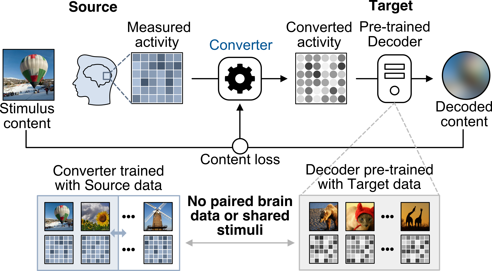

<!-- Improved compatibility of back to top link: See: https://github.com/othneildrew/Best-README-Template/pull/73 -->
<a name="readme-top"></a>

<!-- PROJECT SHIELDS -->
[![Contributors][contributors-shield]][contributors-url]
[![Forks][forks-shield]][forks-url]
[![Stargazers][stars-shield]][stars-url]
[![Issues][issues-shield]][issues-url]

<br />

<h2 align="center">Inter-individual and inter-site neural code conversion</h2>

  <p align="center">
Haibao Wang, Jun Kai Ho, Fan L. Cheng, Shuntaro C. Aoki, Yusuke Muraki, Misato Tanaka, Yukiyasu Kamitani
<p align="center">


<div align="center">

  <a href="https://github.com/KamitaniLab/InterSiteNeuralCodeConversion/blob/main/">
    
  </a> 

</div>

<!-- MARKDOWN LINKS & IMAGES -->
<!-- https://www.markdownguide.org/basic-syntax/#reference-style-links -->
[contributors-shield]: https://img.shields.io/github/contributors/KamitaniLab/InterSiteNeuralCodeConversion.svg?style=for-the-badge
[contributors-url]: https://github.com/KamitaniLab/InterSiteNeuralCodeConversion/graphs/contributors
[forks-shield]: https://img.shields.io/github/forks/KamitaniLab/InterSiteNeuralCodeConversion.svg?style=for-the-badge
[forks-url]: https://github.com/KamitaniLab/InterSiteNeuralCodeConversion/forks
[stars-shield]: https://img.shields.io/github/issues/KamitaniLab/InterSiteNeuralCodeConversion.svg?style=for-the-badge
[stars-url]: https://github.com/KamitaniLab/InterSiteNeuralCodeConversion/stargazers
[issues-shield]: https://img.shields.io/github/stars/KamitaniLab/InterSiteNeuralCodeConversion.svg?style=for-the-badge
[issues-url]: https://github.com/KamitaniLab/InterSiteNeuralCodeConversion/issues
[license-shield]: https://img.shields.io/github/license/github_username/repo_name.svg?style=for-the-badge
[license-url]: https://github.com/github_username/repo_name/blob/master/LICENSE.txt

## Getting Started
This repository provides tools for training neural code converters, and testing these converters for decoding decoding and image reconstruction from brain activity.

### Build Environment

Step1: Navigate to the base directory and create the environment by running the following command.
  ```sh
  conda env create -f env.yaml
  ```
Step2: Activate the environment.
  ```sh
  conda activate NCC
  ```
## Usage
### Pre-train Decoders

To pre-train the decoders, use the following command:

```sh
python feature-decoding/featdec_fastl2lir_train.py feature-decoding/config/deeprecon_pyfastl2lir_alpha100_vgg19_allunits.yaml
```

### Train Neural Code Converters

#### Content Loss-based Training

To train the neural code converters using content loss for subject pairs, execute:

```sh
python NCC_content_loss/NCC_train.py --cuda
```

- **Note**: Use the `--cuda` flag when running on a GPU server. Omit `--cuda` if training on a CPU server.

#### Brain Loss-based Training

To train the neural code converters using brain loss for subject pairs, execute:

```sh
python NCC_brain_loss/NCC_train.py
```

### Test Neural Code Converters

#### 1. DNN Feature Decoding

To decode DNN features from converted brain activities, use the following commands:

- For content loss-based converters:

  ```sh
  python NCC_content_loss/NCC_test.py
  ```

- For brain loss-based converters:

  ```sh
  python NCC_brain_loss/NCC_test.py
  ```

#### 2. Image Reconstruction

To reconstruct images from the decoded features:

1. Navigate to the `reconstruction` directory.
2. Follow the provided README for detailed instructions on setting up the environment and usage.

## Citation

Wang, H., Ho, J. K., Cheng, F. L., Aoki, S. C., Muraki, Y., Tanaka, M., & Kamitani, Y. (2024). Inter-individual and inter-site neural code conversion without shared stimuli. arXiv preprint arXiv:2403.11517.

<p align="right">(<a href="#readme-top">back to top</a>)</p>
